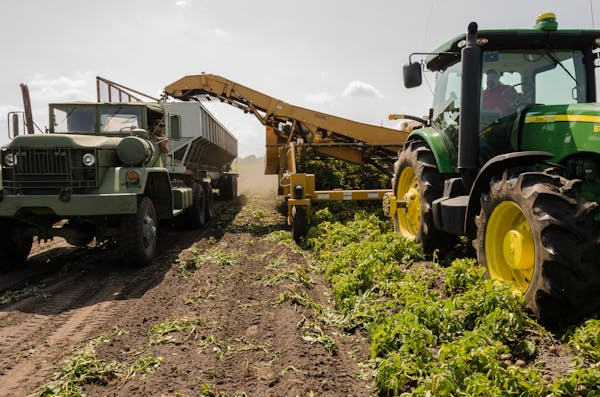

# Agricultural Insights Website

This project is a responsive website designed to provide insights into modern agricultural practices. It features a clean and user-friendly interface with sections for a hero banner, cards showcasing agricultural technologies, and contact information.

## Table of Contents

- [Features](#features)
- [Technologies Used](#technologies-used)
- [Folder Structure](#folder-structure)
- [How to Run the Project](#how-to-run-the-project)
- [Screenshots](#screenshots)
- [License](#license)

## Features

1. **Responsive Header**: A fixed header with navigation links for easy access to different sections of the page.
2. **Hero Section**: A visually appealing hero section with a call-to-action button.
3. **Card Section**: Informative cards showcasing various agricultural technologies and practices.
4. **Contact Section**: Links to social media profiles and contact options.
5. **Footer**: A simple footer with copyright information.

## Technologies Used

- **HTML5**: For structuring the content.
- **CSS3**: For styling the website, including responsive design.
- **JavaScript**: For adding interactivity (future enhancements).
- **Font Awesome**: For icons in the contact section.
- **Google Fonts**: For custom typography.

## Folder Structure

- `index.html`: The main HTML file for the website.
- `css/styles.css`: Contains all the styles for the website.
- `images/`: A folder containing images used in the project.
- `js/script.js`: A placeholder for JavaScript functionality (currently empty).

## How to Run the Project

1. Clone the repository or download the project files.
2. Open the `index.html` file in your browser to view the website.

## Screenshots

### Hero Section


### Card Section


 ## How to Run the Project

1. Clone the repository or download the project files.
2. Open the `index.html` file in your browser to view the website.

## How to Clone the Repository

To clone this repository, follow these steps:

1. Open your terminal or command prompt.
2. Navigate to the directory where you want to clone the project.
3. Run the following command:

```bash
   git clone https://github.com/your-username/agricultural-insights-website.git
```
# 1. Fork the repository
# Go to the GitHub page and click the "Fork" button.

# 2. Clone your fork to your local machine
git clone https://github.com/your-username/your-forked-repo.git

# 3. Navigate into the project directory
cd your-forked-repo

# 4. Set the original repository as the upstream remote
git remote add upstream https://github.com/original-owner/original-repo.git

# 5. Create a new branch for your feature or fix
git checkout -b your-feature-branch

# 6. Make your changes and commit them
git add .
git commit -m "Add: Your meaningful commit message"

# 7. Push your branch to your fork
git push origin your-feature-branch

# 8. Open a Pull Request
# Go to GitHub, compare & create a pull request to the original repository.

